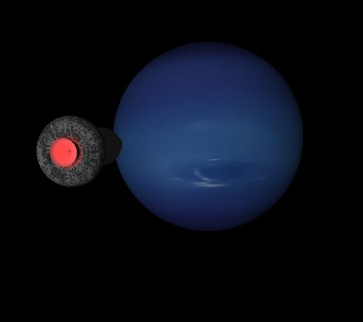
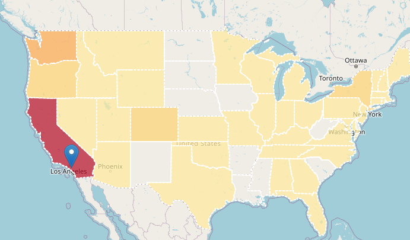
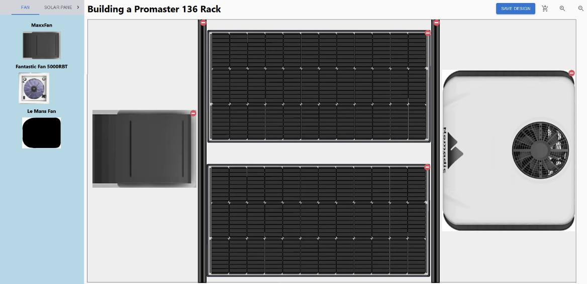
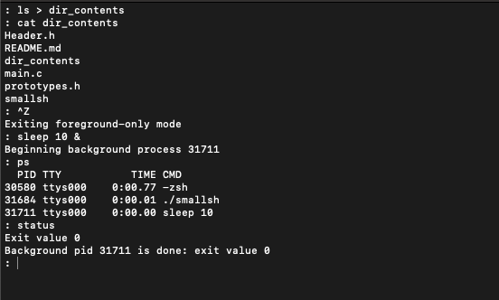
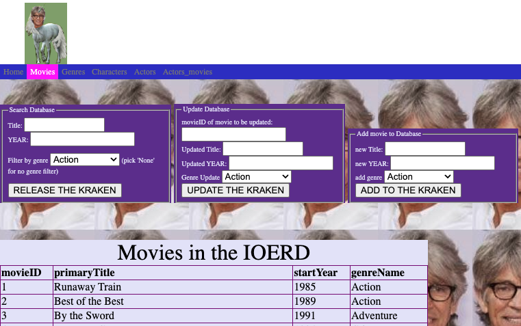

# Portfolio site
[www.davidcornett.dev](https://davidcornett.dev/)

Welcome! This repo shows off some of my projects, created with a wide range of technologies. They either follow my interests or build on my previous professional experience. Feel free to explore and reach out if you have any questions or want to collaborate.

## Projects

### Solar System FTL Journey

* **Description**: Graphical simulation with close-to-accurate scale of solar system, where the player flies a spaceship by all planets at extremely high speeds. There are some cool effects like light attenuation as you travel away from the sun, making planets increasingly dimmer. Stars also blue-shift and red-shift, depending on flight velocity and direction.
* **Technologies**: C++, OpenGL
* **Repository**: [GitHub link](https://github.com/davidcornett/FTL_Solar_System_Tour)
* **Screenshots**: 

### EdTraverse University Analytics

* **Description**: A webapp with a RESTful API backend created as a demo for a business venture I launched, allowing users to retrieve forecasted growth/decline of universities. The projections are based on an algorithm I designed to model revenue changes over 5 and 10 years to 3,000 colleges based on their demographics, selectivity, and the job growth prospects of their academic programs.
* **Technologies**: React, Next.js, Python, Material UI
* **Demo**: https://www.edtraverse.com/
* **Repository**: [GitHub link](https://github.com/davidcornett/watering_hole)
* **Screenshots**: 

### Adventure Van Roof Rack - Web Configurator

* **Description**: I was part of a continuous integration team of 4 developers that built a Shopify integrated custom webapp for Orion Van Gear. We streamlined the roof rack design process for their engineers and customers by creating a drag and drop product configurator. I developed features including automatic grid resizing based on rack size, product querying and filtering, exclusion zones due to roof obstacles, and user-specified pre-installed roof appliances.
* **Technologies**: React, Remix, GraphQL, Shopify API, Tailwind, Material UI
* **Repository**: Due to an NDA, I can't share source code.
* **Screenshots**: 

### Unix Shell

* **Description**: A multi-process program using to enable execution of user commands, replicating a subset of BASH functionality. The shell supports background processes, input/output redirection, and special handling for SIGINT and SIGTSTP. I implemented this by using the operating system API and system calls like fork, exec, and wait.
* **Technologies**: C, operating system API
* **Repository**: [GitHub link](https://github.com/davidcornett/shell_program)
* **Screenshots**: 

### Eric Roberts Movie Database

* **Description**: A CRUD app (with a 90s feel) dedicated to the voluminous work of Eric Roberts. Users can create, read, update, and delete movie data. I created this along with another CS student at Oregon State to learn relational databases and have some fun. We designed the front-end to reach previously unheard-of levels of taste and subtlety...
* **Technologies**: Python, Flask, MySQL
* **Repository**: [GitHub link](https://github.com/davidcornett/ER-database)
* **Screenshots**: 

## About Me

Most of my projects follow my interests or build on my previous career.

I'm an engineer at heart. So after 10 years in insurance product management, I decided to get a 2nd degree in Computer Science from Oregon State University, studying on nights and weekends. After graduating in 2023, I moved to Tel Aviv and started a higher education data analytics business, www.edtraverse.com.

To finalize my career pivot, I'm seeking a junior developer position. I enjoy both front-end and back-end development.

## Contact

* Email: davidgcornett@gmail.com
* LinkedIn: https://www.linkedin.com/in/davidcornett/

